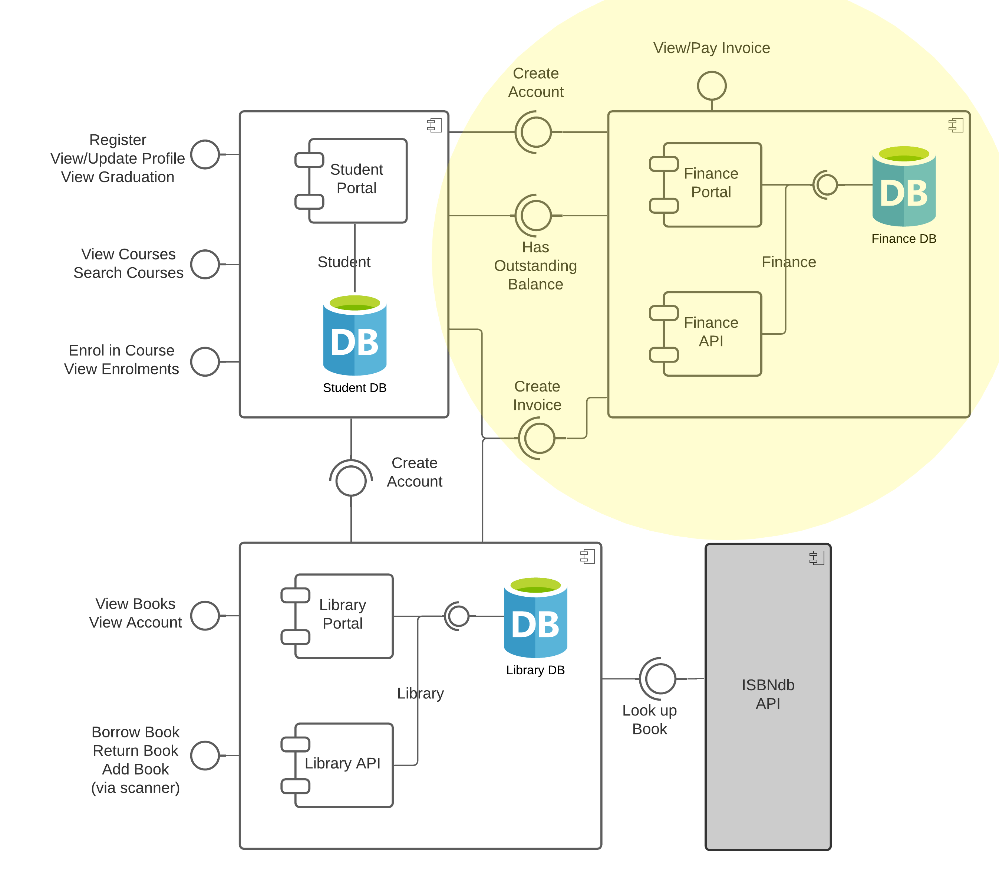

# Student Portal Application
This is a simple microservices-based application which exposes a RESTful API and has Web Portal. It is written in Java using the Spring Boot framework. It is intended for use as part of the SESC module at Leeds Beckett University.

## Features
1. Register/Log in - create a student account and login to system.
2. View Courses - find all available courses.
3. Enrol in Course - - you can enroll into all available courses.
4. View Enrolments - view all enroll courses.
5. View/Update Student Profile - you can view and update your student basic profile.
6. Graduation - you can graduate.

## Integrations
### 1. Database
The application integrates with a Mongodb database. 

## Run using mvn co
1. Run using mvn spring-boot:run

## Test using Postman
Download Postman from https://www.postman.com/ and import the collections found in the `student/postman` directory.

## License
Copyright (c) 2023 Narayan Joshi

Permission is hereby granted, free of charge, to any person obtaining a copy
of this software and associated documentation files (the "Software"), to deal
in the Software without restriction, including without limitation the rights
to use, copy, modify, merge, publish, distribute, sublicense, and/or sell
copies of the Software, and to permit persons to whom the Software is
furnished to do so, subject to the following conditions:

The above copyright notice and this permission notice shall be included in all
copies or substantial portions of the Software.

THE SOFTWARE IS PROVIDED "AS IS", WITHOUT WARRANTY OF ANY KIND, EXPRESS OR
IMPLIED, INCLUDING BUT NOT LIMITED TO THE WARRANTIES OF MERCHANTABILITY,
FITNESS FOR A PARTICULAR PURPOSE AND NONINFRINGEMENT. IN NO EVENT SHALL THE
AUTHORS OR COPYRIGHT HOLDERS BE LIABLE FOR ANY CLAIM, DAMAGES OR OTHER
LIABILITY, WHETHER IN AN ACTION OF CONTRACT, TORT OR OTHERWISE, ARISING FROM,
OUT OF OR IN CONNECTION WITH THE SOFTWARE OR THE USE OR OTHER DEALINGS IN THE
SOFTWARE.